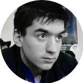

---

Aged 27, I am living close to Paris.

Soon to finish my current studies in 42 school.
I would like to work in C/C++, on embedded system projects.

Looking for an internship for september.

You can contact me at  `roulin.aleandre@gmail.com`

 

## Latest Projects 

- [**N-Puzzle**](https://github.com/Krystalz42/n-puzzle), Resolver of an n-puzzle algorithm.
- [**Nibbler**](https://github.com/Krystalz42/nibbler), Snake Multiplayer
- [**42sh**](https://github.com/Krystalz42/42sh), Shell implementation in C 

 

## Experience 

#### Mobile application Internship, [Kraze](https://www.kraze.fr/)
##### May 2018 - August 2018 (6 months)  | Paris

Developing mobile application in Kotlin and script on JS

---

 

## Education

#### Computer Science, [42](https://www.42.fr/)
##### (2017 - 2019) | Paris

42 is a private, nonprofit and tuition-free computer programming school created and funded by French billionaire Xavier Niel. 

 

## Stack

### Programming

- C, C++

### Languages

- French and English.

 

