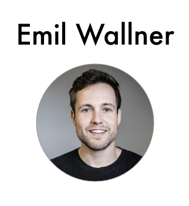

  
  
  

---

I am currently looking for a final internship in Sweden. I am finishing my studies at 42 school, in Paris. 
I really want to try Sweden and hopefully, be able to move in there after the internship.
 

## Latest Projects 

- [**N-Puzzle**](https://github.com/Krystalz42/n-puzzle), Resolver of an n-puzzle algorithm.
- [**Nibbler **](https://github.com/Krystalz42/nibbler), Snake Multiplayer
- [**42sh**](https://github.com/Krystalz42/42sh), Shell implementation in C 

 

## Experience 

#### Deep Learning Internship, [FloydHub (YC W17)](https://www.floydhub.com/)
##### July 2017 - January 2018 (7 months)  | San Francisco Bay Area

Developing deep learning projects and documenting the process.

--- 

#### Co-founder, [Emerge Education](https://emerge.education/)
##### December 2012 - November 2014 (2 years) | London

Europe's leading seed investor for edtech companies.

---

#### TA and Developer, [University of Oxford - Said Business School](https://www.sbs.ox.ac.uk/)
##### April 2012 - January 2014 (1 year 10 months) | Oxford

I assisted their MBA course on design thinking and did websites for the Skoll Centre.

---

 

## Education

#### Computer Science, [42](https://www.42.fr/)
##### (2016 - 2019) | Paris

42 is a private, nonprofit and tuition-free computer programming school created and funded by French billionaire Xavier Niel. 

 

## Stack

### Programming

- C, C++

### Languages

- French and English.

 

